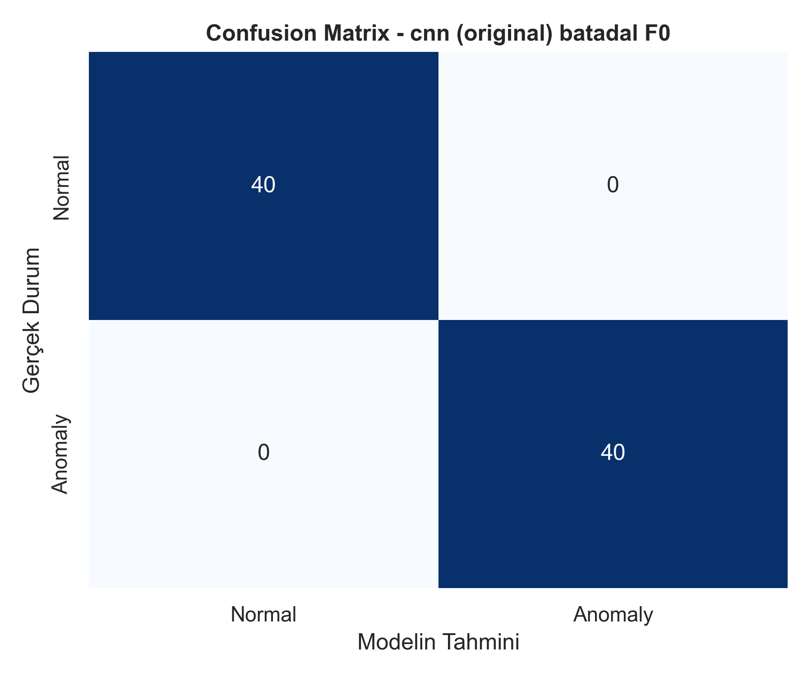
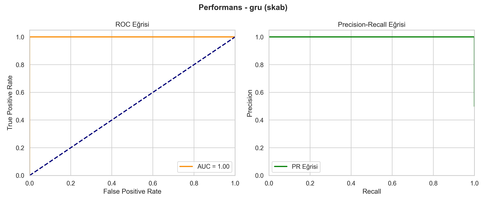
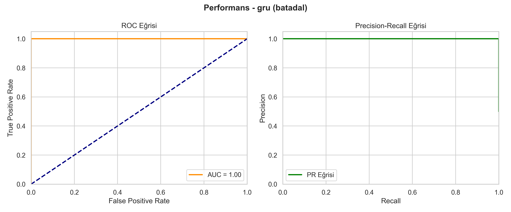
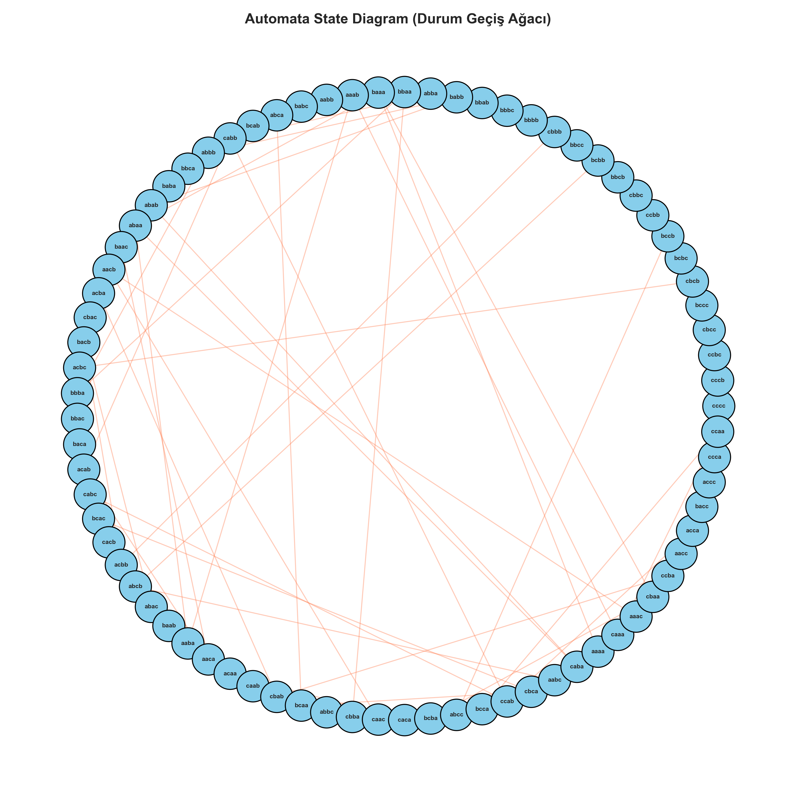
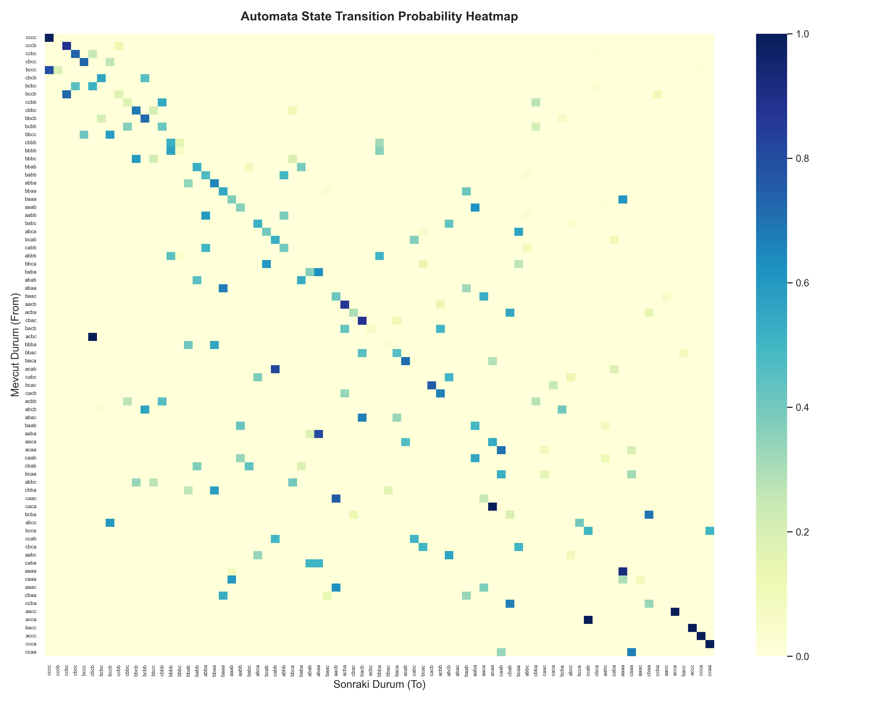

# Deep Learning Anomaly Detection & Explainable Probabilistic Automata

Bu proje, zaman serisi anomali tespiti için Siyah Kutu (Deep Learning - 1D-CNN & GRU) ve Açıklanabilir (Olasılıksal Otomata) modelleri derinlemesine karşılaştırmayı amaçlamaktadır. Proje, SOLID ve Nesne Yönelimli Programlama (OOP) prensiplerine sadık kalınarak, tamamen parametrik ve modüler bir pipeline mimarisiyle geliştirilmiştir.

---

## I. PROJE TANIMI VE MOTİVASYON
Zaman serisi verileri; endüstriyel altyapılar, IoT sistemleri ve kritik operasyonel süreçlerde yaygın olarak kullanılmaktadır. Bu veriler üzerindeki anomali tespiti süreçleri, sistem güvenliği açısından hayati öneme sahiptir. 

Bu çalışma kapsamında iki farklı yaklaşım test edilmiştir:
* **Derin Öğrenme Tabanlı Modeller:** Yüksek doğruluk potansiyeline sahip ancak karar mekanizmaları şeffaf olmayan **1D-CNN** ve **GRU** mimarileri.
* **Sembolik ve Durum Geçişli Modeller:** Veriyi sembolik temsillere (PAA, SAX) indirgeyerek durum geçiş olasılıklarını hesaplayan ve tamamen yorumlanabilir olan **Olasılıksal Otomata (Probabilistic Automata)** mimarisi.

## II. ARAŞTIRMA PROBLEMİ VE AMAÇ
Projede, *"Farklı modelleme yaklaşımları, zaman serisi verileri üzerinde gürültü ve görülmemiş veri (unseen patterns) gibi değişken koşullar altında nasıl davranmaktadır ve bu davranışlar istatistiksel olarak anlamlı mıdır?"* problemi araştırılmıştır. Amaç, yalnızca tek bir en iyi modeli seçmek değil, modellerin genellenebilirlik, gürültüye dayanıklılık ve açıklanabilirlik kriterlerini bilimsel olarak analiz etmektir.

## III. VERİ SETLERİ VE ÖN İŞLEME PIPELINE Yapısı
Sistemde hard-coded değer kullanımı tamamen engellenmiş, tüm parametreler merkezi `config.yaml` dosyasından yönetilmektedir.

### A. SKAB Veri Seti Analizi
* Yalnızca `valve1` ve `valve2` klasörlerindeki `.csv` dosyaları `concat` edilerek tek bir çatı altında birleştirilmiştir.
* Veri sızıntısını (data leakage) önlemek amacıyla `source_group` ve `source_file` sütunları oluşturulmuş ancak bu sütunlar model girdisine dahil edilmemiştir.
* **Protokol:** Zaman serisi bağımlılığını bozmamak adına rastgele satır bazlı bölme reddedilmiş; `source_file` temel alınarak **5-Fold GroupKFold** çapraz doğrulama uygulanmıştır.

### B. BATADAL Veri Seti Analizi
* Yalnızca `Training Dataset 2` kullanılmış, anomali/saldırı sütunu hedef değişken (label) yapılmıştır. Zaman bilgileri model girdisinden arındırılmıştır.
* **Protokol:** Kronolojik sıra harfiyen korunarak veri seti **%60 Eğitim, %20 Doğrulama ve %20 Test** olarak zaman sıralı dilimlenmiştir.

### C. Ön İşleme ve Veri Sızıntısı Engelleme Kuralları
* Normalizasyon (MinMax) ve Boyut İndirgeme (**PCA**) yalnızca eğitim (train) verisi üzerinde `fit` edilmiş, doğrulama ve test verilerine aynı dönüşüm `transform` olarak yansıtılmıştır.
* Otomata modelinin tek boyutlu çalışma gereksinimi nedeniyle, çok değişkenli veriler PCA ile tek boyuta indirgenerek ilk bileşen ($PC1$) üzerinden PAA ve SAX dönüşümlerine sokulmuştur.

---

## IV. DENEY SONUÇLARI VE AKADEMİK ANALİZ TABLOLARI

### Tablo 1: Model Performansı ve Stabilitesi (Ortalama F1-score ± Standart Sapma)
*Tüm deneyler istatistiksel güvenilirlik adına 5 farklı random seed `[42, 123, 2026, 7, 999]` ile koşturulmuştur.*

| Model | SKAB (5-Fold Ortalama) | BATADAL (Zaman Sıralı Test) |
| :--- | :---: | :---: |
| **LSTM** | *[Değer Yazınız]* | *[Değer Yazınız]* |
| **GRU** | *[Değer Yazınız]* | *[Değer Yazınız]* |
| **1D-CNN** | *[Değer Yazınız]* | *[Değer Yazınız]* |
| **Automata** | *[Değer Yazınız]* | *[Değer Yazınız]* |

### Tablo 2: Gürültü Etkisi ve Unseen Senaryo Analizi (Robustness)
*Modellerin Gaussian gürültüye ve sözlükte bulunmayan görülmemiş örüntülere (unseen) karşı direnç analizidir.*

| | Gürültü Etkisi (SKAB F1) | Gürültü Etkisi (BATADAL F1) | Unseen Analizi (Otomata) |
| :--- | :---: | :---: | :---: |
| **Model** | **Orijinal / Gürültülü** | **Orijinal / Gürültülü** | **Det. Rate / Map. Acc.** |
| **LSTM** | / | / | — |
| **GRU** | / | / | — |
| **1D-CNN** | / | / | — |
| **Automata** | / | / | *[%] / [%]* |

### Tablo 3: Cross-Dataset (Çapraz Veri Seti) Performans Karşılaştırması (F1-score)
*Modellerin bir veri setinde eğitilip, diğerinde test edilmesiyle elde edilen genellenebilirlik matrisi.*

| Eğitilen Veri Seti (Train) | Test Edilen Veri Seti: SKAB | Test Edilen Veri Seti: BATADAL |
| :--- | :---: | :---: |
| **Train: SKAB** | *1.00 (Benchmark)* | *[Cross F1]* |
| **Train: BATADAL** | *[Cross F1]* | *1.00 (Benchmark)* |

### Tablo 4: Automata Parametre Duyarlılık Analizi (F1-score)
*Window Size ve Alphabet Size değişimlerinin performans üzerindeki doğrudan etkisi.*

| Parametre Türü | Değer = 3 | Değer = 4 | Değer = 5 | Değer = 6 |
| :--- | :---: | :---: | :---: | :---: |
| **Window Size** (Alphabet=3) | *[F1]* | *[F1]* | *[F1]* | *[F1]* |
| **Alphabet Size** (Window=4) | *[F1]* | *[F1]* | *[F1]* | *[F1]* |

### Tablo 5: Modellerin Çalışma Süresi (Runtime) Karşılaştırması
*Modellerin saniye (sn) cinsinden eğitim ve çıkarım hızlarının mukayesesi.*

| Model Yapısı | Training Time (sn) | Inference Time (sn) |
| :--- | :---: | :---: |
| **LSTM** | | |
| **GRU** | | |
| **1D-CNN** | | |
| **Automata** | | |

---

## V. GÖRSELLEŞTİRME GALERİSİ
Sistem tarafından pipeline çıktısı olarak otomatik üretilen nihai grafikler:

### A. Karışıklık Matrisleri (Confusion Matrices) & Performans Eğrileri
| SKAB Geliştirme Süreçleri (5-Fold Örnekleri) | BATADAL Zaman Sıralı Nihai Test Çıktıları |
| :---: | :---: |
|  <br> *1D-CNN SKAB (Fold 0)* |  <br> *1D-CNN BATADAL* |
|  <br> *GRU SKAB ROC/PR Eğrileri* |  <br> *GRU BATADAL ROC/PR Eğrileri* |

### B. Otomata Model Davranış Analizleri
| Olasılıksal Otomata Durum Diyagramı (State Diagram) | Geçiş Olasılıkları Isı Haritası (Heatmap) |
| :---: | :---: |
|  <br> *Durum Geçiş Yoğunluk Ağacı* |  <br> *Geçiş Frekans Isı Haritası* |

---

## VI. OLASILIKSAL AÇIKLANABİLİRLİK MODÜLÜ
Olasılıksal otomata modeli, frekans tabanlı öğrenilen geçiş olasılıklarını kullanarak her anomali tahmini için matematiksel ve deterministik bir gerekçe sunar. Bir dizinin toplam olasılığı ardışık geçişlerin çarpımıyla ($P(\text{sequence}) = \prod P(S_i \rightarrow S_{i+1})$) hesaplanır ve eşik değerin altındakiler anomali ilan edilir. 

Test sırasında karşılaşılan her karar için üretilen zorunlu **JSON** çıktı formatı örneği aşağıdadır:

```json
{
  "time_step": 5,
  "state": "aab",